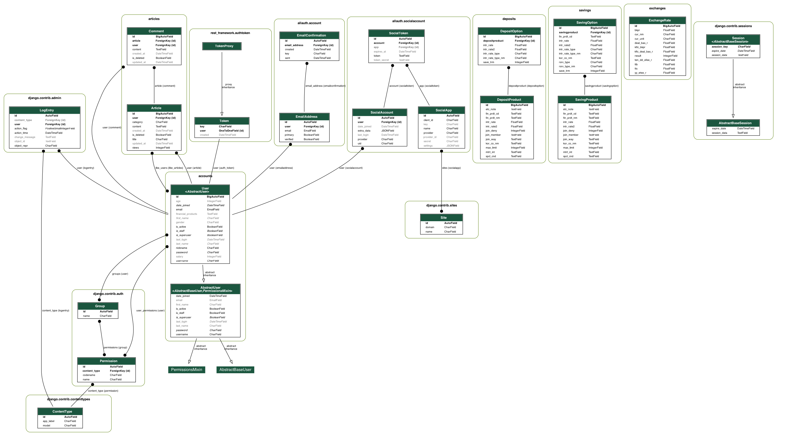

#### 금융 프로젝트 - 프로젝트명
  
## 목차

- [프로젝트 개요](#프로젝트-개요)
  - [프로젝트 소개](#1-프로젝트-소개)
  - [기술 스택 및 개발 도구](#2-기술-스택-및-개발-도구)
  - [팀원 구성 및 역할 분담](#3-팀원-구성-및-역할-분담)
  - [초기 세팅](#4-초기-세팅)
  - [초기 디자인](#5-레이아웃-디자인-초안)
- [프로젝트 결과](#프로젝트-결과)
  - [ERD](#1-erd)
  - [컴포넌트 구조도](#2-컴포넌트-구조도)
  - [필수 기능](#3-필수-기능)
  - [추가 기능](#4-추가-기능)
- [프로젝트 규칙](#프로젝트-규칙)
- [느낀 점](#느낀-점)

## 프로젝트 개요

### 1. 프로젝트 소개

- 프로젝트 소개

### 2. 기술 스택 및 개발 도구


---

### 3. 팀원 구성 및 역할 분담

- 팀장: [손원륜](https://github.com/Rootn61)
 - 레이아웃 디자인 초안 작성
 - 전반적인 페이지 구조 및 디자인 작성, 보완
 - Javascript를 이용하여 메인페이지, 예적금 상세페이지 구현
 - 로고 디자인, ppt 작성
 - [깃허브 주소]
  
- 팀원: [이상현](https://github.com/dltkdgus482)
  - Django 및 백엔드 개발 담당
  - Vue.js와 Django 간의 통신 구현
  - 예, 적금 상품 추천 알고리즘 구현
  - 데이터베이스 모델링

---

### 4. 초기 세팅

1. 프론트 환경 변수(.env)

```
VITE_APP_KAKAO_MAP_API_KEY='카카오맵 API 키'
```

2. 서버 환경 변수(.env)

```
OPEN_AI_API_KEY='OPENAI API 키'
API_KEY='한국수출입은행 API 키'
NAVER_MAIL_API_KEY='네이버메일 API 키'
```

3. 서버 모듈 업그레이드

```
pip install --upgrade setuptools
```

4. 더미 데이터 로딩

```
python manage.py loaddata articles.json deposits.json exchanges.json savings.json user_data.json
```
---

### 5. 레이아웃 디자인 초안
https://www.figma.com/board/NanCGXaL5DGpS5MlIT2rZp/Untitled?node-id=0%3A1&t=iV61CAvUGQAz5qgq-1


## 프로젝트 결과

### 1. ERD


---

### 2. 컴포넌트 구조도

```
.
├── App.vue
├── components
│   ├── ArticleCreateComponents
│   │   ├── ArticleCreateBody.vue
│   │   ├── ArticleCreateHeader.vue
│   │   └── ArticleCreateNav.vue
│   ├── ArticleDetailComponents
│   │   ├── ArticleDetailBody.vue
│   │   ├── ArticleDetailHeader.vue
│   │   ├── ArticleDetailNav.vue
│   │   ├── CommentCreate.vue
│   │   └── CommentList.vue
│   ├── ArticleListComponents
│   │   ├── ArticleList.vue
│   │   ├── ArticleListBody.vue
│   │   ├── ArticleListHeader.vue
│   │   └── ArticleListNav.vue
│   ├── ArticleUpdateComponents
│   │   ├── ArticleUpdateBody.vue
│   │   ├── ArticleUpdateHeader.vue
│   │   └── ArticleUpdateNav.vue
│   ├── DepositDetailComponents
│   │   ├── DepositDetailBody.vue
│   │   ├── DepositDetailHeader.vue
│   │   └── DepositDetailNav.vue
│   ├── DepositListComponents
│   │   ├── DepositListBody.vue
│   │   └── DepositListNav.vue
│   ├── ExchangeRateComponents
│   │   ├── ExchangeRateBody.vue
│   │   ├── ExchangeRateHeader.vue
│   │   └── ExchangeRateNav.vue
│   ├── LoginComponents
│   │   ├── LoginBody.vue
│   │   └── LoginNav.vue
│   ├── MainPageComponents
│   │   ├── MainPageBody.vue
│   │   ├── MainPageChatbot.vue
│   │   ├── MainPageHeader.vue
│   │   └── MainPageNav.vue
│   ├── MapComponents
│   │   ├── Map.vue
│   │   ├── MapBody.vue
│   │   ├── MapFooter.vue
│   │   ├── MapHeader.vue
│   │   ├── MapInfo.vue
│   │   └── MapNav.vue
│   ├── ProfileComponents
│   │   ├── ProfileBody.vue
│   │   ├── ProfileFooter.vue
│   │   ├── ProfileHeader.vue
│   │   └── ProfileNav.vue
│   ├── SavingDetailComponents
│   │   ├── SavingDetailBody.vue
│   │   ├── SavingDetailHeader.vue
│   │   └── SavingDetailNav.vue
│   ├── SignUpComponents
│   │   ├── SignUpBody.vue
│   │   ├── SignUpHeader.vue
│   │   └── SignUpNav.vue
│   ├── StockDetailComponents
│   │   ├── StockDetailBody.vue
│   │   ├── StockDetailHeader.vue
│   │   └── StockDetailNav.vue
│   ├── StockListComponents
│   │   ├── StockList.vue
│   │   ├── StockListBody.vue
│   │   ├── StockListHeader.vue
│   │   ├── StockListLike.vue
│   │   └── StockListNav.vue
│   ├── UpdatePasswordComponents
│   │   ├── UpdatePasswordBody.vue
│   │   ├── UpdatePasswordHeader.vue
│   │   └── UpdatePasswordNav.vue
│   └── UpdateUserComponents
│   │   ├── UpdateUserBody.vue
│   │   ├── UpdateUserFooter.vue
│   │   ├── UpdateUserHeader.vue
│   │   └── UpdateUserNav.vue
│   ├── TopNavbar.vue
│   ├── Footer.vue
│   ├── BottomNavbar.vue
│   └── Chatbot.vue
├── main.js
├── router
│   └── index.js
├── stores
│   └── counter.js
└── views
    ├── ArticleCreateView.vue
    ├── ArticleDetailView.vue
    ├── ArticleUpdateView.vue
    ├── ArticleView.vue
    ├── DepositDetailView.vue
    ├── DepositView.vue
    ├── ExchangeRateView.vue
    ├── LoginView.vue
    ├── MainView.vue
    ├── MapView.vue
    ├── ProfileView.vue
    ├── SavingDetailView.vue
    ├── SignUpView.vue
    ├── StockDetailView.vue
    ├── StockView.vue
    ├── UpdatePasswordView.vue
    └── UpdateUserView.vue
```

---

### 3. 필수 기능
1. 메인 페이지
2. 회원 관리 기능
3. 환율 계산기
4. 근처 은행 검색
5. 게시판
6. 프로필 페이지(예적금 금리 비교)
7. 금융 상품 추천 알고리즘
  - 
  - 

---

### 4. 추가 기능
1. 챗봇
2. 가상화폐 시세 실시간 제공
3. 이메일 인증

## 프로젝트 규칙

```
# 제목은 대문자로 시작합니다.
# 본문과 푸터는 선택 사항 입니다.
#######제목#######

#######본문#######

#######푸터#######

# --- COMMIT END ---
#   <타입> 리스트
#   feat        : 기능 (새로운 기능)
#   fix         : 버그 (버그 수정)
#   refactor    : 리팩토링
#   design      : CSS 등 사용자 UI 디자인 변경
#   comment     : 필요한 주석 추가 및 변경
#   style       : 스타일 (코드 형식, 세미콜론 추가: 비즈니스 로직에 변경 없음)
#   docs        : 문서 수정 (문서 추가, 수정, 삭제, README)
#   test        : 테스트 (테스트 코드 추가, 수정, 삭제: 비즈니스 로직에 변경 없음)
#   chore       : 기타 변경사항 (빌드 스크립트 수정, assets, 패키지 매니저 등)
#   init        : 초기 생성
#   rename      : 파일 혹은 폴더명을 수정하거나 옮기는 작업만 한 경우
#   remove      : 파일을 삭제하는 작업만 수행한 경우
# ------------------
#   제목 첫 글자를 대문자로
#   제목은 명령문으로
#   제목 끝에 마침표(.) 금지
#   제목과 본문을 한 줄 띄워 분리하기
#   본문은 "어떻게" 보다 "무엇을", "왜"를 설명한다.
#   본문에 여러줄의 메시지를 작성할 땐 "-"로 구분
# ------------------
#   <꼬리말>
#   필수가 아닌 optioanl
#   Fixes        :이슈 수정중 (아직 해결되지 않은 경우)
#   Resolves     : 이슈 해결했을 때 사용
#   Ref          : 참고할 이슈가 있을 때 사용
#   Related to   : 해당 커밋에 관련된 이슈번호 (아직 해결되지 않은 경우)
#   ex) Fixes: #47 Related to: #32, #21
```

## 느낀 점

- 손원륜
  - 
  - 

- 이상현
  - 
  - 